# NEXTDEBUT ERD Confirmed

실제 기준:
- `src/main/resources/schema.sql`
- JPA 엔티티 (`src/main/java/...`)
- 실제 H2 파일 DB `data/projectxdb.mv.db`

아래는 발표용으로 우선 설명하기 좋은 핵심 테이블이다.

## 1. MEMBER
- `MNO` PK
- `MID`
- `MPW`
- `MNAME`
- `NICKNAME`
- `EMAIL`
- `PHONE`
- `ADDRESS`
- `ADDRESS_DETAIL`
- `JUMIN`
- `PROFILE_IMAGE`
- `ROLE`
- `CREATED_AT`
- `SUSPENDED_UNTIL`
- `REROLL_REMAINING`
- `REROLL_LAST_AT`
- `COIN`
- `RANK_EXP`
- `MEMBER_RANK`
- `GROUP_UNLOCK_MASK`
- `PROGRESS_VERSION`
- `MYPAGE_CARD_TRAINEE_ID`
- `MYPAGE_REP_TRAINEE_ID`

## 2. BOARD
- `ID` PK
- `BOARD_TYPE`
- `CATEGORY`
- `TITLE`
- `CONTENT`
- `ORIGINAL_FILENAME`
- `STORED_FILENAME`
- `IS_IMAGE`
- `AUTHOR_NICK`
- `AUTHOR_MNO`
- `VIEW_COUNT`
- `LIKE_COUNT`
- `VISIBLE`
- `POPUP`
- `SECRET`
- `CREATED_AT`
- `PLACE_NAME`
- `ADDRESS`
- `TRAINEE_ID`
- `LAT`
- `LNG`
- `EVENT_AT`
- `RECRUIT_STATUS`
- `MAX_CAPACITY`
- `PARTICIPATION_TYPE`
- `FAN_MEET_APPROVED`
- `EFFECT_TYPE`
- `EFFECT_VALUE`
- `EVENT_START_AT`
- `EVENT_END_AT`
- `IS_EVENT_ACTIVE`
- `BANNER_ENABLED`

## 3. BOARD_COMMENT
- `ID` PK
- `BOARD_ID` FK -> `BOARD.ID`
- `CONTENT`
- `AUTHOR_NICK`
- `AUTHOR_MNO`
- `CREATED_AT`

## 4. BOARD_LIKE
- `ID` PK
- `BOARD_ID`
- `MNO`
- unique: `(BOARD_ID, MNO)`

## 5. BOARD_REPORT
- `ID` PK
- `TARGET_TYPE`
- `TARGET_ID`
- `REPORTER_MNO`
- `REPORTER_NICK`
- `REASON`
- `DESCRIPTION`
- `STATUS`
- `CREATED_AT`
- unique: `(TARGET_TYPE, TARGET_ID, REPORTER_MNO)`

## 6. FANMEETING_PARTICIPANT
- `ID` PK
- `POST_ID`
- `USER_ID`
- `USER_NICK`
- `STATUS`
- `CREATED_AT`

## 7. TRAINEE
- `ID` PK
- `NAME`
- `GENDER`
- `GRADE`
- `VOCAL`
- `DANCE`
- `STAR`
- `MENTAL`
- `TEAMWORK`
- `IMAGE_PATH`
- `AGE`
- `BIRTHDAY`
- `HEIGHT`
- `WEIGHT`
- `HOBBY`
- `MOTTO`
- `INSTAGRAM`
- `PERSONALITY_CODE`
- `CREATED_AT`

## 8. MY_TRAINEE
- `ID` PK
- `MEMBER_ID`
- `TRAINEE_ID`
- `QUANTITY`
- `ENHANCE_LEVEL`
- unique: `(MEMBER_ID, TRAINEE_ID)`

## 9. PHOTO_CARD_MASTER
- `ID` PK
- `TRAINEE_ID` FK -> `TRAINEE.ID`
- `CARD_GRADE`
- `DISPLAY_NAME`
- `IMAGE_URL`
- unique: `(TRAINEE_ID, CARD_GRADE)`

## 10. USER_PHOTO_CARD
- `ID` PK
- `MEMBER_ID`
- `PHOTO_CARD_MASTER_ID` FK -> `PHOTO_CARD_MASTER.ID`
- `OWNED_AT`
- unique: `(MEMBER_ID, PHOTO_CARD_MASTER_ID)`

## 11. EQUIPPED_PHOTO_CARD
- `ID` PK
- `MEMBER_ID`
- `TRAINEE_ID` FK -> `TRAINEE.ID`
- `PHOTO_CARD_MASTER_ID` FK -> `PHOTO_CARD_MASTER.ID`
- `EQUIPPED_AT`
- unique: `(MEMBER_ID, TRAINEE_ID)`

## 12. MARKET_TXN
- `ID` PK
- `MEMBER_ID`
- `TXN_TYPE`
- `ITEM_NAME`
- `COIN_DELTA`
- `NOTE`
- `CREATED_AT`

## 13. GACHA_PULL_LOG
- `ID` PK
- `MEMBER_ID`
- `TRAINEE_ID`
- `GRADE`
- `POOL_ID`
- `CREATED_AT`

## 14. MY_ITEM
- `ID` PK
- `MEMBER_ID` FK -> `MEMBER.MNO`
- `ITEM_NAME`
- `QUANTITY`
- unique: `(MEMBER_ID, ITEM_NAME)`

## 15. GAME_RUN
- `ID` PK
- `GROUP_TYPE`
- `PLAYER_MNO`
- `CREATED_AT`
- `CONFIRMED`
- `PHASE`
- `CURRENT_SCENE_ID`
- `MID_EVAL_TIER`
- `MID_EVAL_EFFECT_UNTIL_TURN`
- `FATIGUE`
- `CORE_FANS`
- `CASUAL_FANS`
- `LIGHT_FANS`
- `FAN_EVENT_FLAGS`
- `FAN_REWARD_APPLIED`
- `REROLL_REMAINING`
- `REROLL_LAST_AT`
- `FINISHED_AT`
- `SCORE_CACHE`

## 16. GAME_RUN_MEMBER
- `ID` PK
- `RUN_ID` FK -> `GAME_RUN.ID`
- `TRAINEE_ID` FK -> `TRAINEE.ID`
- `PICK_ORDER`
- `CREATED_AT`
- `STATUS_CODE`
- `STATUS_LABEL`
- `STATUS_DESC`
- `STATUS_TURNS_LEFT`

## 17. GAME_TURN_LOG
- `ID` PK
- `RUN_ID`
- `TURN_INDEX`
- `PHASE`
- `BUCKET`
- `SCENE_ID`
- `EVENT_TYPE`
- `CHOICE_KEY`
- `STAT_TARGET`
- `DELTA`
- `BEFORE_VAL`
- `AFTER_VAL`
- `CREATED_AT`

## 18. GAME_SCENE
- `ID` PK
- `PHASE`
- `EVENT_TYPE`
- `TITLE`
- `DESCRIPTION`

## 19. GAME_CHOICE
- `ID` PK
- `PHASE`
- `CHOICE_KEY`
- `CHOICE_TEXT`
- `STAT_TARGET`
- `SORT_ORDER`

## 20. GAME_MINI_QUIZ
- `ID` PK
- `HINT`
- `ANSWER`
- `SORT_ORDER`
- `ENABLED`

## 21. CASTING_MAP_DAILY_EXPLORE
- `ID` PK
- `MEMBER_ID`
- `EXPLORE_DATE`
- `EXPLORE_COUNT`
- unique: `(MEMBER_ID, EXPLORE_DATE)`

## 22. CASTING_SPOT_BUFF
- `ID` PK
- `MEMBER_ID`
- `REGION_CODE`
- `SPOT_LABEL`
- `EFFECT_TYPE`
- `EFFECT_VALUE`
- `EXPIRE_AT`
- `CREATED_AT`

## 23. CHAT_ROOM
- `ROOM_ID` PK
- `ROOM_NAME`
- `CREATOR_NICKNAME`
- `SECRET`
- `PASSWORD`
- `CREATED_AT`

## 24. CHAT_ROOM_LINE
- `ID` PK
- `ROOM_ID`
- `NICKNAME`
- `CONTENT`
- `SENT_AT`

## 25. CHAT_ROOM_VISITOR
- `ID` PK
- `ROOM_ID`
- `NICKNAME`
- `FIRST_SEEN`
- unique: `(ROOM_ID, NICKNAME)`

## 26. CHAT_MODERATION_LOG
- `ID` PK
- `ROOM_ID`
- `ROOM_NAME`
- `NICKNAME`
- `CONTENT`
- `REASON`
- `CREATED_AT`

## 27. MEMBER_SANCTION
- `ID` PK
- `MEMBER_MNO`
- `ADMIN_MNO`
- `ADMIN_NICK`
- `SANCTION_DAYS`
- `REASON`
- `CREATED_AT`
- `EXPIRES_AT`

## 발표용 핵심 관계
- `MEMBER` 1:N `BOARD`
- `BOARD` 1:N `BOARD_COMMENT`
- `BOARD` 1:N `BOARD_LIKE`
- `BOARD` 1:N `FANMEETING_PARTICIPANT`
- `MEMBER` 1:N `MY_ITEM`
- `MEMBER` 1:N `MY_TRAINEE`
- `TRAINEE` 1:N `MY_TRAINEE`
- `TRAINEE` 1:N `PHOTO_CARD_MASTER`
- `PHOTO_CARD_MASTER` 1:N `USER_PHOTO_CARD`
- `PHOTO_CARD_MASTER` 1:N `EQUIPPED_PHOTO_CARD`
- `MEMBER` 1:N `MARKET_TXN`
- `MEMBER` 1:N `GACHA_PULL_LOG`
- `GAME_RUN` 1:N `GAME_RUN_MEMBER`
- `TRAINEE` 1:N `GAME_RUN_MEMBER`
- `GAME_RUN` 1:N `GAME_TURN_LOG`
- `MEMBER` 1:N `CASTING_MAP_DAILY_EXPLORE`
- `MEMBER` 1:N `CASTING_SPOT_BUFF`
- `CHAT_ROOM` 1:N `CHAT_ROOM_LINE`
- `CHAT_ROOM` 1:N `CHAT_ROOM_VISITOR`

## Mermaid ERD

```mermaid
erDiagram
    MEMBER ||--o{ BOARD : writes
    MEMBER ||--o{ MY_ITEM : owns
    MEMBER ||--o{ MY_TRAINEE : owns
    MEMBER ||--o{ MARKET_TXN : logs
    MEMBER ||--o{ GACHA_PULL_LOG : pulls
    MEMBER ||--o{ CASTING_MAP_DAILY_EXPLORE : explores
    MEMBER ||--o{ CASTING_SPOT_BUFF : receives
    MEMBER ||--o{ MEMBER_SANCTION : sanctioned

    BOARD ||--o{ BOARD_COMMENT : has
    BOARD ||--o{ BOARD_LIKE : has
    BOARD ||--o{ FANMEETING_PARTICIPANT : has

    TRAINEE ||--o{ MY_TRAINEE : collected
    TRAINEE ||--o{ PHOTO_CARD_MASTER : has
    TRAINEE ||--o{ GAME_RUN_MEMBER : selected
    TRAINEE ||--o{ EQUIPPED_PHOTO_CARD : equipped_for

    PHOTO_CARD_MASTER ||--o{ USER_PHOTO_CARD : owned_as
    PHOTO_CARD_MASTER ||--o{ EQUIPPED_PHOTO_CARD : equipped_as

    GAME_RUN ||--o{ GAME_RUN_MEMBER : includes
    GAME_RUN ||--o{ GAME_TURN_LOG : logs

    CHAT_ROOM ||--o{ CHAT_ROOM_LINE : contains
    CHAT_ROOM ||--o{ CHAT_ROOM_VISITOR : tracks

    MEMBER {
      bigint MNO PK
      varchar MID
      varchar MPW
      varchar MNAME
      varchar NICKNAME
      varchar EMAIL
      int COIN
      varchar ROLE
      varchar MEMBER_RANK
      timestamp CREATED_AT
    }

    BOARD {
      bigint ID PK
      varchar BOARD_TYPE
      varchar CATEGORY
      varchar TITLE
      clob CONTENT
      bigint AUTHOR_MNO
      bigint VIEW_COUNT
      bigint LIKE_COUNT
      boolean SECRET
      timestamp CREATED_AT
    }

    BOARD_COMMENT {
      bigint ID PK
      bigint BOARD_ID FK
      clob CONTENT
      varchar AUTHOR_NICK
      bigint AUTHOR_MNO
      timestamp CREATED_AT
    }

    TRAINEE {
      bigint ID PK
      varchar NAME
      varchar GENDER
      varchar GRADE
      int VOCAL
      int DANCE
      int STAR
      int MENTAL
      int TEAMWORK
    }

    MY_TRAINEE {
      bigint ID PK
      bigint MEMBER_ID
      bigint TRAINEE_ID
      int QUANTITY
      int ENHANCE_LEVEL
    }

    PHOTO_CARD_MASTER {
      bigint ID PK
      bigint TRAINEE_ID FK
      varchar CARD_GRADE
      varchar DISPLAY_NAME
      varchar IMAGE_URL
    }

    USER_PHOTO_CARD {
      bigint ID PK
      bigint MEMBER_ID
      bigint PHOTO_CARD_MASTER_ID FK
      timestamp OWNED_AT
    }

    EQUIPPED_PHOTO_CARD {
      bigint ID PK
      bigint MEMBER_ID
      bigint TRAINEE_ID FK
      bigint PHOTO_CARD_MASTER_ID FK
      timestamp EQUIPPED_AT
    }

    MARKET_TXN {
      bigint ID PK
      bigint MEMBER_ID
      varchar TXN_TYPE
      varchar ITEM_NAME
      int COIN_DELTA
      timestamp CREATED_AT
    }

    GACHA_PULL_LOG {
      bigint ID PK
      bigint MEMBER_ID
      bigint TRAINEE_ID
      varchar GRADE
      varchar POOL_ID
      timestamp CREATED_AT
    }

    GAME_RUN {
      bigint ID PK
      bigint PLAYER_MNO
      varchar GROUP_TYPE
      varchar PHASE
      int FATIGUE
      int CORE_FANS
      int CASUAL_FANS
      int LIGHT_FANS
      timestamp CREATED_AT
    }

    GAME_RUN_MEMBER {
      bigint ID PK
      bigint RUN_ID FK
      bigint TRAINEE_ID FK
      int PICK_ORDER
      varchar STATUS_CODE
    }

    GAME_TURN_LOG {
      bigint ID PK
      bigint RUN_ID
      int TURN_INDEX
      varchar PHASE
      varchar CHOICE_KEY
      varchar STAT_TARGET
      int DELTA
    }

    CHAT_ROOM {
      varchar ROOM_ID PK
      varchar ROOM_NAME
      varchar CREATOR_NICKNAME
      boolean SECRET
      timestamp CREATED_AT
    }

    CHAT_ROOM_LINE {
      bigint ID PK
      varchar ROOM_ID
      varchar NICKNAME
      varchar CONTENT
      timestamp SENT_AT
    }
```

